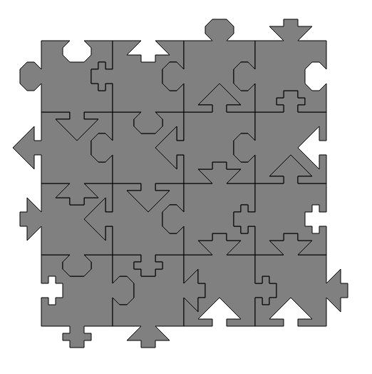

# The Ultimate Puzzle Solver

## Setup
Python 3.7 was used.

```sh
python3 -m venv venv
```

On Linux/Mac OS, run:
```sh
source venv/bin/activate
pip install -r requirements.txt
```

On Windows, run:
```powershell
venv/Scripts/Activate.ps1 (Powershell)
venv/Scripts/activate.bat (Command Prompt)
```

Install requirements:
```sh
pip install -r requirements.txt
```

## Computation
Start the computation by running `bfs_solver.py`. Simple Breadth-First-Search of solutions is implemented.  

A grid of 4x4 is established. In first step, each of 16 pieces is placed in first cell. Each piece has 4 different rotations, meaning that there are 64 possible placements of first piece. The number of possible combinations when filling out the grid with pieces is printed after each of 16 steps.  

At the end, 48 different solutions are possible. Due to symmetry, there are actually just 12 solutions, each with 4 rotations.  

The solution is horrible both time- and space-complexity wise. Anyway, the puzzle is solved, optimizations might be done in the future.

## View solutions
Solutions are stored in `solver.possible_solutions`, a list of `Puzzle` objects.  
Such object can be passed to 
`generate_svg_views(puzzle_obj, svg_filename_str)`. 

Solution example:  

## TO-DO
Group solutions differing only on rotations.    
Implement DFS solution.  
Allow piece flipping.  
Try out parallelization.
